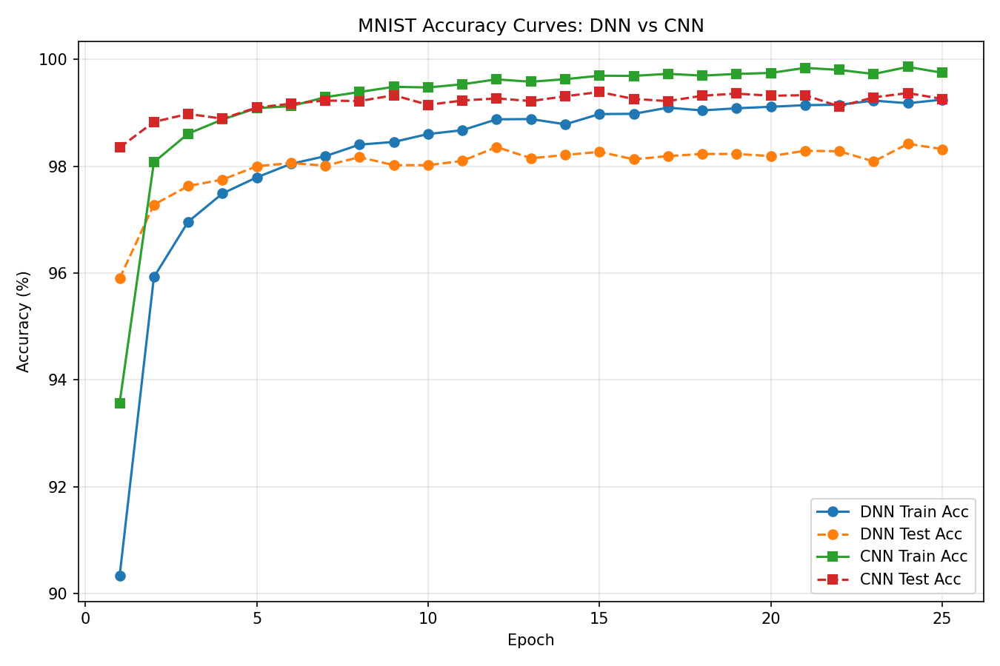
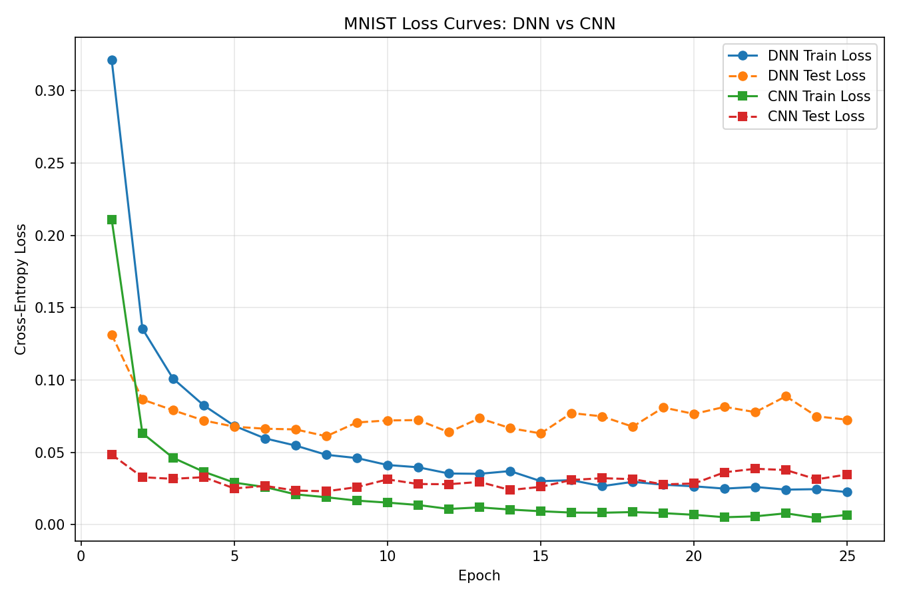

# MNIST Classification: DNN vs CNN

## 1. Experiment Setup

* **Dataset:** MNIST (full training and test sets)
* **Epochs:** 25
* **Batch Size:** 128
* **Optimizer:** Adam (learning rate = 0.001)
* **Device:** CUDA (GPU acceleration)

---

## 2. Model Architectures

To make the two architectures easier to compare, the layouts are shown side-by-side below.

<table>
  <tr>
    <th style="text-align:left; vertical-align:top; padding-right:1rem;">DNN (Fully Connected Network)</th>
    <th style="text-align:left; vertical-align:top;">CNN (Convolutional Neural Network)</th>
  </tr>
  <tr>
    <td style="vertical-align:top;">
<pre>
Input (1 × 28 × 28)
        │
Flatten (784)
        │
Linear (784 → 256)
        │
ReLU
        │
Dropout (p=0.2)
        │
Linear (256 → 128)
        │
ReLU
        │
Dropout (p=0.2)
        │
Linear (128 → 10)
        │
Output (class logits)
</pre>
    </td>
    <td style="vertical-align:top;">
<pre>
Input (1 × 28 × 28)
        │
Conv2D (1 → 32, 3×3, padding=1)
        │
ReLU
        │
MaxPool (2×2) → (32 × 14 × 14)
        │
Conv2D (32 → 64, 3×3, padding=1)
        │
ReLU
        │
MaxPool (2×2) → (64 × 7 × 7)
        │
Flatten (3136)
        │
Linear (3136 → 128)
        │
ReLU
        │
Dropout (p=0.3)
        │
Linear (128 → 10)
        │
Output (class logits)
</pre>
    </td>
  </tr>
</table>

---

## 3. Quantitative Comparison

| Model | Best Test Accuracy | Final Test Accuracy | Parameters | Training Time |
| ----- | -----------------: | ------------------: | ---------: | ------------: |
| DNN   |             98.42% |              98.32% |    235,146 |       51.47 s |
| CNN   |             99.39% |              99.26% |    421,642 |       52.75 s |

Comparing CNNs to DNNs, we see a +0.97% point increase in the accuracy, with only minimal increase in training time (+1.28 seconds) but much larger parameter count (1.79x). 

---

## 4. Training Behavior Analysis

### Accuracy Trends

The accuracy trends highlight clear differences in how the two models learn over time. The DNN begins with relatively strong performance but quickly plateaus at around 98.3 to 98.4%, indicating that additional training provides minimal benefit. In contrast, the CNN improves more steadily across epochs and ultimately reaches a higher accuracy of approximately 99.3%. Throughout training, the CNN maintains a consistent performance advantage over the DNN.

### Loss Trends

The loss curves further reinforce these observations. The CNN’s training and test loss decrease smoothly and approach near-zero values, indicating strong convergence and effective optimization. On the other hand, the DNN’s loss decreases initially but then plateaus, with the test loss even showing a slight upward trend. This behavior suggests mild overfitting and limited capacity to improve beyond a certain point. The stagnation in test loss aligns with the observed plateau in accuracy for the DNN.

### Generalization

In terms of generalization, the CNN demonstrates a smaller train-test gap (~0.49%) compared to the DNN (~0.93%). This smaller gap indicates that the CNN generalizes better to unseen data. Overall, the training behavior suggests that the CNN not only achieves higher performance but also learns more robust and transferable representations. I would assume that this difference in robustness would become larger with a more difficult dataset, as MNIST is very simple. 

You can also see the training log in `./output.log`. 

---

## 5. Discussion

The results clearly show that the CNN outperforms the DNN on the MNIST classification task, primarily due to its ability to exploit the spatial structure of image data. While the DNN begins with relatively strong performance, it quickly plateaus, indicating that it struggles to extract additional useful features as training progresses. In contrast, the CNN continues to improve over more epochs, achieving both higher accuracy and lower loss. This difference can be attributed to the convolutional layers, which preserve spatial relationships between pixels and learn localized features such as edges and strokes key components for digit recognition.

The loss curves further highlight this distinction in learning behavior. The CNN’s training and test loss decrease steadily and converge toward very low values, suggesting effective optimization and strong generalization. On the other hand, the DNN’s test loss stabilizes early and even shows slight upward drift, which may indicate mild overfitting. This is supported by the larger train-test gap observed in the DNN compared to the CNN. Overall, the CNN demonstrates not only better final performance but also more stable and meaningful learning dynamics throughout training.

---

## 6. Conclusion

In conclusion, the CNN achieves superior performance over the DNN on the MNIST dataset under the same training conditions. Although the CNN requires more parameters and slightly longer training time, the improvement in accuracy and generalization is substantial. The results reinforce the importance of choosing model architectures that align with the structure of the data. In this case, leveraging convolutional layers for image inputs. While the DNN serves as a useful baseline, it is ultimately less effective for this task. Therefore, CNNs should be preferred for image classification problems, as they provide both higher accuracy and more reliable convergence behavior.
